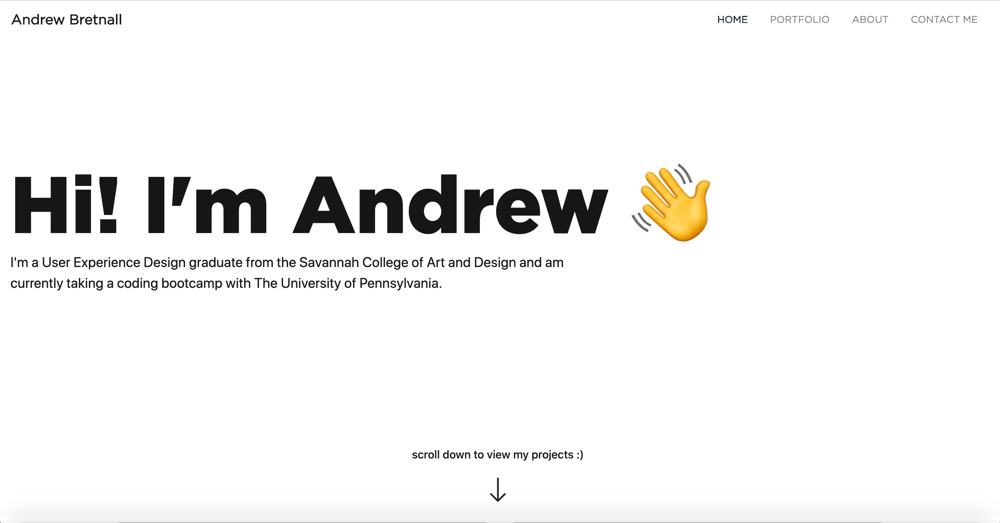
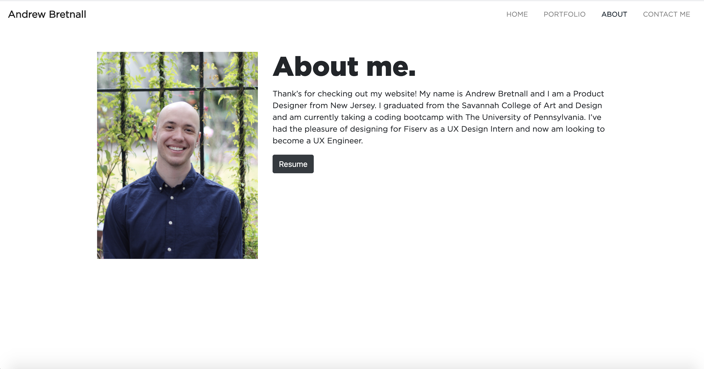
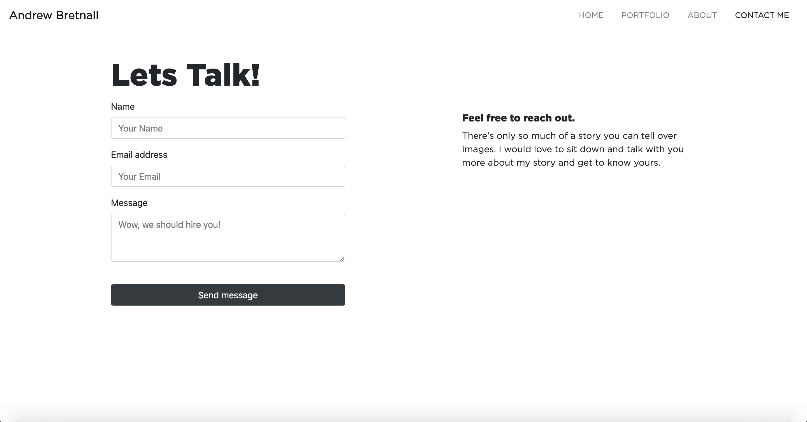

https://andbret.github.io/

## Description 

This is my first attempt at coding a portfolio using HTML and CSS. I wanted to have some fun and give the landing page some personality by adding animations. My other pages used only bootstrap. Hopefully this will serve as a jumping off point for creating a better portfolio with javascript. My main goal was to experiment and create a visually appealing website, and in that regard I believe I was successful. I definitely learned a lot messing around and seeing what was possible.

## Tech used

HTML & CSS

## Images

## Credits

I used some code to make an animation from here: https://css-tricks.com/snippets/css/typewriter-effect/

## License

MIT License
Copyright (c) [2000] [Andrew Bretnall]

    Permission is hereby granted, free of charge, to any person obtaining a copy
    of this software and associated documentation files (the "Software", to deal
    in the Software without restriction, including without limitation the rights
    to use, copy, modify, merge, publish, distribute, sublicense, and/or sell
    copies of the Software, and to permit persons to whom the Software is
    furnished to do so, subject to the following conditions:

    The above copyright notice and this permission notice shall be included in all
    copies or substantial portions of the Software.

    THE SOFTWARE IS PROVIDED "AS IS", WITHOUT WARRANTY OF ANY KIND, EXPRESS OR
    IMPLIED, INCLUDING BUT NOT LIMITED TO THE WARRANTIES OF MERCHANTABILITY,
    FITNESS FOR A PARTICULAR PURPOSE AND NONINFRINGEMENT. IN NO EVENT SHALL THE
    AUTHORS OR COPYRIGHT HOLDERS BE LIABLE FOR ANY CLAIM, DAMAGES OR OTHER
    LIABILITY, WHETHER IN AN ACTION OF CONTRACT, TORT OR OTHERWISE, ARISING FROM,
    OUT OF OR IN CONNECTION WITH THE SOFTWARE OR THE USE OR OTHER DEALINGS IN THE
    SOFTWARE.

